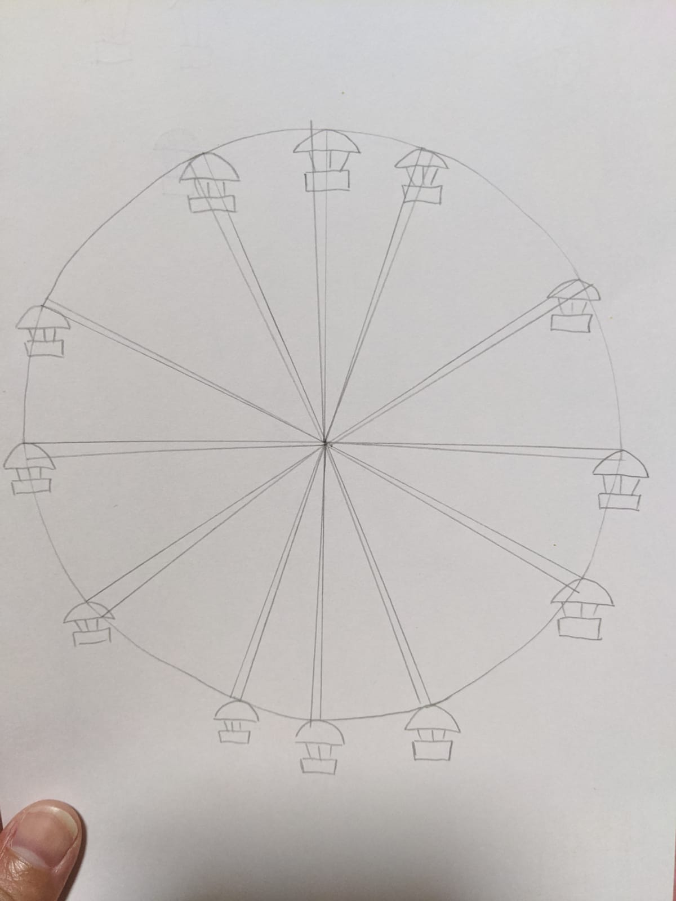

# Ferris Clock

First implementation of a Flutter project for the Flutter Clock Challenge [flutter.dev/clock](https://flutter.dev/clock). 

Please forgive me for the noob codes >.<

## Features
- Each beam represents the hour hand
- When the pod is lit, it means the hour has passed
- Minutes is shown on the beam as gradient
- The wheel rotation represents seconds

Light mode

Dark mode

Demo

### Web Preview

https://jiayike.github.io/flutter_clock/

## Initial Design

From design idea to actual working clock!

&nbsp;&nbsp;&nbsp;&nbsp;

## TODOs:

- [x] CI/CD for web
- [ ] Tests cases
- [ ] Use stream instead of setState for time updating
- [ ] Optimisation
- [ ] Extract variables to separate file
- [ ] Weather background
